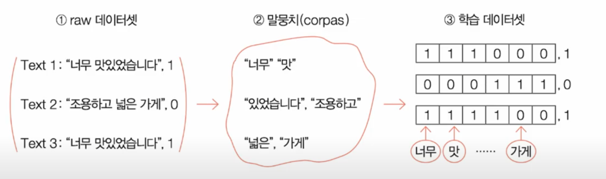
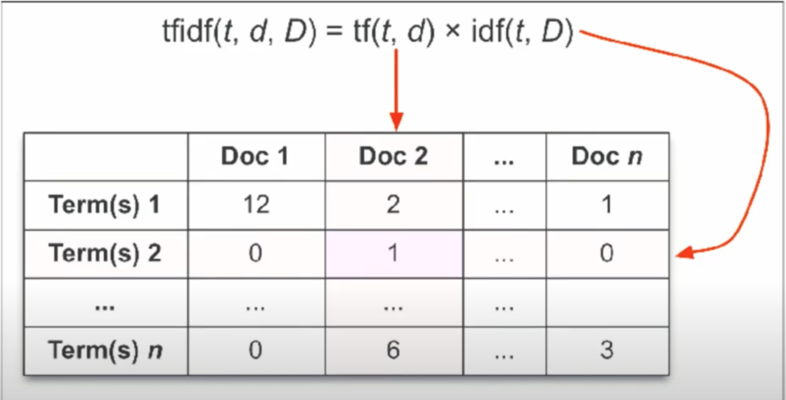

# 한국어 형태소 분석

###### github.com/jw0831 (20.10.17) 작성

#### 필요한것 

- **자바** 

  - > pip install JPype1-0.6.3-cp37-cp37m-win_amd64.whl
    >
    > mac OS 버전 알아보기
    >
    > 파이썬 버전과 호완이 되는지 확인!
    >
    > 윈도우의 경우 환경변수를 home으로
    >
    > - C:\java <- 변수값 / Java_Home <- 변수 이름
    >
    > 

- **KoNLPY**

  - Twitter Korean Text는 Will Hohyon Ryu가 개발 한 Scala로 작성된 오픈 소스 한국어 토크 나이저 입니다.

  - ```python
    from konlpy.tag import Twitter
    
    twitter = Twitter() #실행 
    
    twitter.morphs() #morphs() 호출/ 사용시 토큰이 나누어진다.
    
    #예시
    twitter.morphs('안녕하세요. 김진원입니다.') # -> ['안녕하세요','.','김','진원','입니다','.']
    # 문장을 text 변수에 담아서 실행할 수 있다.
    ```

- **댓글 수집 (크롤링)**

  - 긍정 부정으로 간단하게 나누는 방법 binary => 1(긍정) 또는 0(부정)
  - 별점 몇 이상 몇 이하로 0 또는 1 지정과 함께 리뷰 저장

- **트레이닝/테스트 셋 분리하기**

  - ```python
    from sklearn.model_selection import train_test_split
    
    train_x, test_x, train_y, testy = train_test_split(text, score, test_size=0.2, random_state=0)
    
    len(train_x), len(train_y)
    len(test_x), len(test_y)
    
    
    from sklearn.feature_extraction.text import TfidfVectorizer
    #min_df=3 개이상 나오는단어들 max_df=90퍼센트이상 나오는 단어 (필요없다고 생각)
    tfv = TfidfVectorizer(tokenizer=twitter.morphs, ngram_range=(1,2), min_df=3, max_df=0.9)
    
    tfv.fit(train_x) #학습
    tfv_train_x=tfv.transform(train_x) #학습후 적용
    tfv_train_x #훈련할 데이터
    
    #이분은 로지스틱 회귀모델 사용
    from sklearn.linear_model import LogisticRegression #이진 분류 알고리즘
    from sklearn.model_selection import GridSearchCV #하이퍼파라미터 최적화
    
    clf = LogisticRegression(random_state=0)
    params = {'C': [1,3,5,7,9]}
    grid_cv =  GridSearchCV(clf, param_grid=params, cv=4, scoring='accuracy', verbose=1) #cv: 자체적인 kfold검증
    grid_cv.fit(tfv_train_x, train_y)
    
    grid_cv.best_params_ #최적의 파라미터 확인
    grid_cv.best_score_ #점수확인
    
    tfv_test_x = tfv.transform(test_x) #예측
    grid_cv.best_estimator_.score(tfv_test_x, test_y) #예측 검증 점수
    
    #ex)
    a = ['아 너무 재미있어요 꼭 보세요']
    my_review = tfv.transform(a)
    grid_cv.best_estimator_.predict(my_review) #결과 1(긍정) 또는 0(부정)
    
    ```

    

## Reference

- [네이버 영화 댓글 긍정부정 파이썬 AI 만들기](https://www.youtube.com/watch?v=XQnB0DKlhd8&list=PLgFRM5Bd2Y4S3AvEN2_NPeOwng3lBPXRj)


# 감성분석

**감성분석**이란 : 

감성분류? 텍스트 마이닝의 일부 

- ​	"이 집 너무 좋아요" -> [0.1, 0.9, 0.2...] 텍스트 데이터를 벡터데이터로 변황 및 몇가지감성으로 분류

감성분류를 시작하기 전에, **텍스트를 연산 가능한 데이터로 변환** :



tf_idf 방법: <**enhanced method** compared above method>

- 문서안에 같은 단어가 너무 많을경우 그리고 해당 문장에서 중요한 단어가 아닌경우를 보안하기 위해서 tf_idf 방법을 사용한다. 
-  tf(term frequency 단어빈도) df(document frequency 문서빈도) i는 inverse(역)
  - idf = inverse document frequency : 로그등 여러가지 계산이 추가되지만 문서 전체에 이 단어가 얼마나 등장하는지를 역수로 표현
  - 그래서 tfidf를 통해서 각 문장에서 각 단어가 얼마나 중요한 단어인지, 전체 데이터를 기반으로 계산해내는 작업
  - tfidf가 항상 더 좋은것은 아니지만 감성분석에서는 tfidf 또는 더 나은 방법을 사용한다.




### 전체적인 감성분류 스텝

1. 크롤링을 통해서 데이터를 수집 : 별점 기준 정하기, 별 4개 이상
2. 데이터 전처리 tf_idf 방법을 사용
3. 전처리된 데이터를 이용해서 분류분석을 감성분석에 적용
4. 긍정 부정 분류를 한 결과를 가지고, 어떤 중요 키워드가 있는지에 대해서 활용해보는 분석을 진행


### Reference

- [텍스트마이닝 - R](https://www.youtube.com/watch?v=N7qzjoVOAJg)
- [이것이 데이터 분석이다 (파이썬 편)](https://www.youtube.com/watch?v=R1hA5qVUnhg&list=PLU7tbC5g03dVTewfoe614vjdBzZcImAVt&index=17)
- [맛집 분류 예제](https://www.youtube.com/watch?v=-eZ8cq9w4jA&list=PLU7tbC5g03dVTewfoe614vjdBzZcImAVt&index=18)

- [종합 예제](https://www.youtube.com/watch?v=O765hclz8aI&list=PLU7tbC5g03dVTewfoe614vjdBzZcImAVt&index=20)

- [맛집 감성분석 여기 참고](https://github.com/haesoly/estimate_review_of_restaurant)

