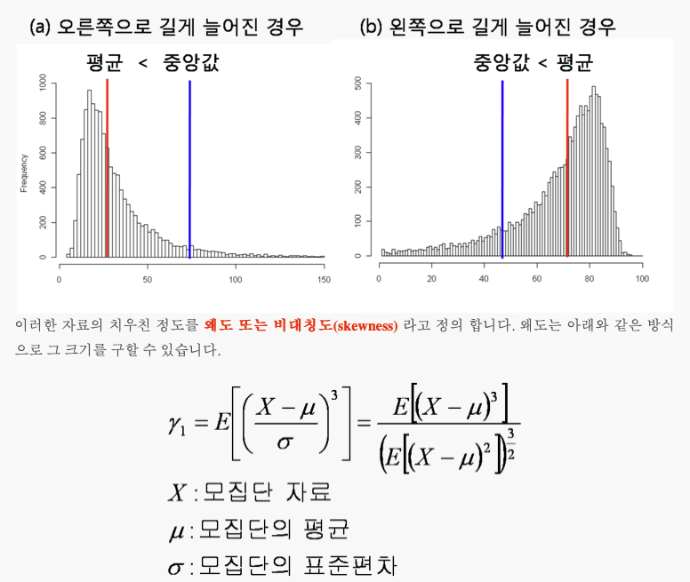
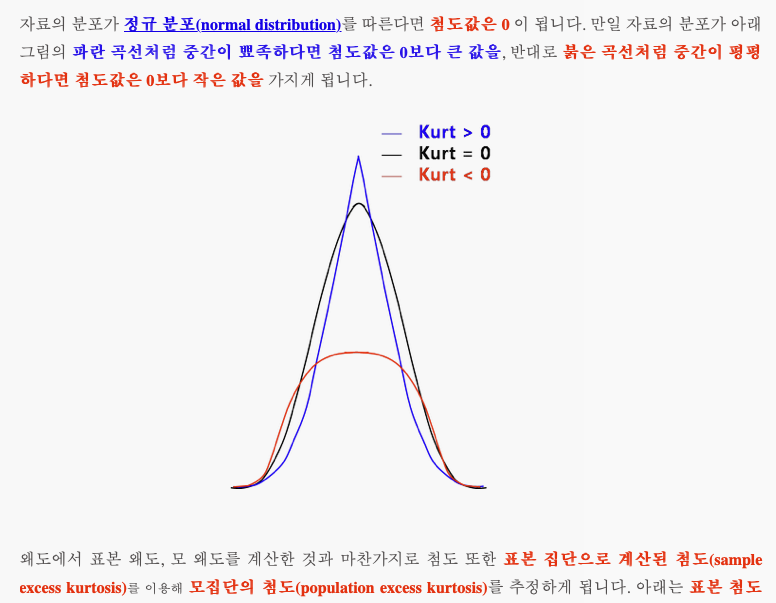

### 상관계수

###### 정규성이 없는 데이터를 정규성을 갖도록 실습 2020/09/29 수업

### 자료 형태: 양적 / 질적 자료

- 양적 자료: 수치형 자료

  - 수치형 자료: 연속형, 이산형 자료로 구분

    > 연속형: 값이 끊어지지 않고 연속적으로 이어지는 자료 (키, 몸무게 등)
    >
    > 이산형: 정수로 나누어지는 자료 (수술 횟수 등)

- 질적 자료: 범주형 자료

  - 범부형 자료: 명목형, 순서형 자료로 구분

    >명목형: 범주들 간에 순서적인 의미가 없는 자료 (혈액형 등)
    >
    >순서형: 범주들 간에 순서적인 의미가 있는 자료 (학점, 아주좋음, 좋음, 보통...등 / 연령대, 10대, 20대,..)

이러한 자료들을 갖고 상관 분석을 진행한다.

#### 상관계수는 자료 형태에 따라 종류가 나누어짐

1. 피어슨 상관계수 (모수적 방법) : 연속형 & 연속형 상관계수
   - 두 변수가 모두 정규성을 따른다는 가정이 필요 (모수적 방법)

**모집단**: 알고싶은 전체 집단

코로나 환자가 있는데, (A라는 약 개발 / 투여 / 얼마나 효과가 있는지 궁금 / 전세계에 있는 모든 환자에 대해 궁금) : 전세계 환자가 모집단, 그런데 전세계를 알기가 어려움. 표본에 대한 표준편차 분산 등을 통해서 모집단을 예측

모수? 모집단 통계치 (평균, 표준편차, 분산 등)

------

#### 모수적 방법? (피어슨 상관분석)

- 연속형 변수

- 중심극한정리? 모집단이 평균, 표준편차 

  - (오해의 요소: 내가 수집한 표본의 크기가 크면 이 표본의 평균이 모집단의 표본과 같고 는 잘못된 생각...)
  - 모집단에서 표본크기가 n인 표본(30개 이상)을 여러 번 추출 (예: 100번 추출) 했을때
  - **표본평균분포** : 1번째 추출: 표본평균, ... 100번째 추출: 표본 평균 들이 이루는 분포
  - 중심극한정리는 표본의 크기가 커질수록 (30개 이상), 표본 평균들이 이루는 분포가 모집단의 평균과 모집단의 표준편차가 정규분포에 가까워진다는 정리임

  ```python
  scipy.stats.pearsonr(x,y) #(0.8962083932927004, 0.00044718052488489286)
  # 상관계수 0.89
  # p value: 0.0004
  # p value: 0.05 (임계치), p값이 0.05 보다 작은경우 "통계적으로 유의미하다" 표현
  ```

  유의수준, 유의확률(p value), 귀무/대립 가설, 1종/2종 오류

  귀무 / 대립 가설?

  20대 남자들의 키와 30대 남자들의 키가 다르다.

  20대와 30대 남자들 각 30명씩 -> 키 측정 -> 각 집단 평균 (기술통계)

  표본으로 추론
  - 추론 통계: 가설을 세우고, 그 가설을 입증
      - 이때 처음 세운 가설: **귀무 가설**
      - 실험자가 입증해야 하는 가설: **대립 가설**
    추론 통계 -> 귀무가설을 기각
    ex) 가설: 범죄자가 범인이라는 가설을 입증하고자 한다면 -> 귀무가설: 범죄자는 범인이 아니다.
    귀무가설을 기각(범죄자가 범인이다) 하기 위해 입증 자료 수집함
      
        실험자가 범할 수 있는 오류
        1종 오류: 귀무가설이 참인데 기각한 경우 (죄가 없는 범인이 죄가 있다고 말한 경우)  
        2종 오류: 귀무가설이 거짓인데 기각하지 않은 경우 (죄가 있는 범인이 죄가 없다고 말한 경우)
      
        > **1종 2종의 오류중 더 심각한것은 1종 오류이다.  
        > 1종 (심각) > 2종  
        > 죄가 없는데 있다고 한경우 더 억울하다.**
    
  - 유의 수준 : 1종 오류를 범할 수 있는 최대 허용 한계
      - ex) 유의수준 : 0.05%(5%)로 정함 -> 100번 실험했을 때 1종 오류를 범할 수 있는 최대 허용 한계 5번
      - 정밀도 요구되는 실험 : 0.01(1%)

  - 유의 확률: p - value, 1종 오류를 범할 확률
      - ex) 0.05(5%) : 100번 실험했을 때 1종 오류를 5번 범한 경우.
      - 의미? 95% 신뢰도로 귀무가설을 기각한다는 의미
      - 0 <= p value <= 1

  - p-value 값이 유의 수준 (0.05)보다 낮다 -> 실험이 통계적으로 의미가 있다!!!

### 상관분석 고려 사항

- 산점도 (선형선(직선) 확인)
- 곡선형? 스피어만, 캔달 상관분석

- 상관관계가 있다고 해서 반드시 인과관계가 있는 건 아니다.
- ex) 제 3변인의 문제
    - 서울에서 범죄 발생 건수와 종교 시설의 개수
    - 양의 상관관계 (교회가 많으면 많을수록 범죄율도 높다) 이 둘사이에 직접적인 관계가 있는것이 아님
        - 제 3의 변인이 있음
    - 극단치로 인한 인위적 상관관계 있을 수 있음.

------

#### 비모수적 방법? (스피어만 상관분석, 켄달[타우])

- 서열이 있는 두 변수들 간의 상관관계

- 정규분포를 따르지 않는다고 증명 or 표본이 (30개 미만, 10개 미만) 소규모인 경우에는 정규분포임을 가정할 수 없을때 비모수적 방법을 사용.
- 자료를 크기 순으로 배열 -> 순위(서열) 매김 -> 순위 합계를 구해서 합계간의 차이를 비교

#### 명목형(이산형) & 명목형(이산형) : 파이계수

- 두 변수가 모두 binary 일때 두 변수간의 상관 계수

#### |상관계수|

- 0.7이상 => 상관관계가 매우 강함
- 0.3이상 => 상관관계가 있음
- 0.1~0.3이상 => 매우 약한 상관관계가 있음
- 0~0.1 => 무상관


**척도**: 변수 값을 표현하는 수준

**명명척도**: (혈액형), 서열척도(순서형, 직급), 등간척도(순서 & 간격 일정, 연산 가능)


**중심경향 (평균, 최빈수, 중앙값) : 자료 전체 대표**

[공분산 참고1](https://m.blog.naver.com/PostView.nhn?blogId=sw4r&logNo=221025662499&proxyReferer=https:%2F%2Fwww.google.com%2F)

[공분산 참고2](http://blog.naver.com/PostView.nhn?blogId=jindog2929&logNo=10161293384)


##### 공분산 해석: 

- \+ : 두 변수가 같은 방향으로 변화

- \-: 두 변수가 반대 방향으로 변화

- 0 : 두 변수가 독립 (서로 아무 상관이 없다.)
  - 주의할점:

  - ```python
    cov(x,y) ; 5
    cov(a,b) ; 1000
    ```

  - 절대적 크기로 해석을 하면 안된다 / 수치의 의미

  - 공분산 만으로는 직접적인 비교가 어려움으로 

  - 공분산 -> 표준화 (-1~1) => 상관계수


##### 상관계수를 **제곱**하면? 분산(변화량)에서 공유하는 비율

- ex) x, y의 상관계수가 0.7 -> 제곱하면 0.49 (49%)

- **의미**: x의 분산중 49% 를 y와 공유한다는 의미임. x의 분산중 49%가 y로 설명할 수 있음


**스피어만 상관계수**

- 서열척도, 비선형적인 관계

```python
import scipy.stats
scipy.stats.spearmanr(x,y).correlation
```

**캔달 상관계수**: 비선형적 & 서열척도 (표본이 작을때)

```python
import scipy.stats
scipy.stats.kendalltau(x,y).correlation
```


------

### 회귀분석 ?

- 독립변수(x)입력변수로 종속변수(y)를 예측하는것

### 혼입변수?

- 모델에는 포함되지 않지만, 종속변수에 영향을 주는 변수

### 선형회기분석?

- 회기분석은 종속변수가 연속인 경우 (regression)
- 종속변수가 **범주**인 경우 : 분류 (classification)
- 선형회기분석: 독립변수와 종속변수 사이에 직선적인 형태의 관계가 있다고 가정하고 분석
- 직선적인 형태? 독립변수가 증가 => 종속변수도 비례하여 증가 or 감소

선형회귀모델에서 x, y 관계 수식 : y=wx + b (w: **weight**, b: **bias**(error) 또는 e를(error 따로 붙인다))

> **w**: 가중치 or 회귀계수,  
>
> 독립변수 x가 1증가하면 종속변수 y는 w만큼 증가한다.  
>
> **b**: 절편(독립변수가 0일때 종속변수 y의 값)

#### 왜도 / 첨도

- #### **왜도**



- 중앙값 > 평균: (오른쪽으로 길게 늘어진 경우): 왜도가 0보다 큰 양수
- 중앙값 < 평균: (왼쪽으로 길게 늘어진 경우): 왜도가 0보다 작은 음수
- 좌우가 대칭: (정규분포): 왜도가 0


- #### 첨도



- 자료의 분포가 뾰족한 정도
- 정규분포 : 첨도가 0 or 3
- 중간이 뾰족한경우: 첨도가 0(3)보다 큰 양수
- 중간이 평평한경우: 첨도가 0(3)보다 작은 음수

[왜도/첨도(scipy.stats.skew)](https://namyoungkim.github.io/python/scipy/2017/10/09/scipy/)

[왜도/첨도1](https://m.blog.naver.com/PostView.nhn?blogId=vics009&logNo=30104825070&proxyReferer=https:%2F%2Fwww.google.com%2F)

[왜도/첨도2](https://m.blog.naver.com/PostView.nhn?blogId=s2ak74&logNo=220616766539&proxyReferer=https:%2F%2Fwww.google.com%2F)

[왜도/첨도3 (설명 좋음)](http://blog.naver.com/PostView.nhn?blogId=istech7&logNo=50154573592)


##### [**베이지안 이론1**](https://bioinformaticsandme.tistory.com/47)

##### [**베이지안 이론2**](https://ddiri01.tistory.com/234)

##### [베이즈 정리](https://junpyopark.github.io/bayes/)

