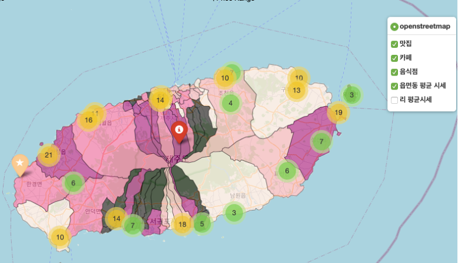
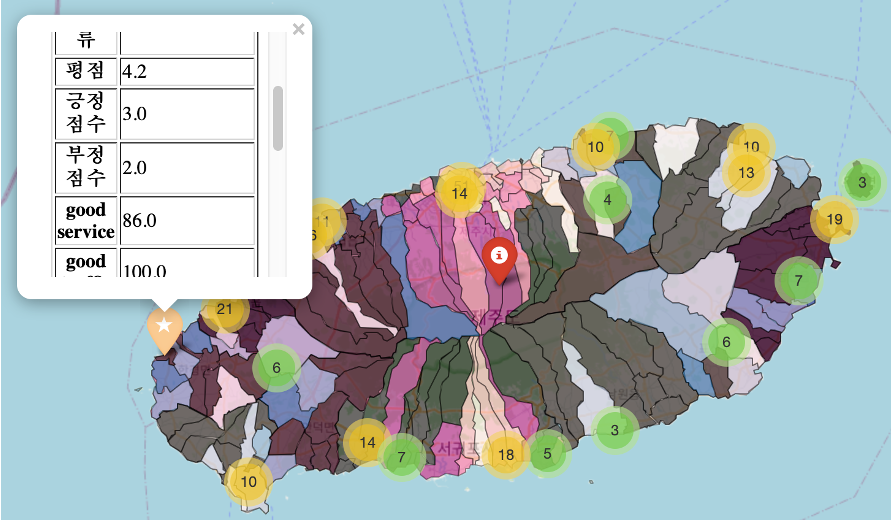

## 멀티캠퍼스 딥러닝 기반 AI엔지니어링 프로젝트-1

# 호갱노노 in 제주

> 맛집 분석을 통해 합리적인 상권을 찾아라!

#### 팀명 : 제주 사다수

---

#### 프로젝트 주제 및 내용

- 제주도 맛집을 통한 상권 분석, 예측 맛집 **분석**
- 평점 데이터와 그 가게의 키워드들이 비례하는지 **예측**
- 가게의 리뷰들이 광고인지 리뷰인지 비교하여 평점 재**산출**
- 많이 언급된 가게 근처에 어떤 상권들이 들어서도 나갔는지 **비교**

---

#### 주제 선정 배경

*더 이상 광고 글에 속지 말자!*

제주도에 여행 갈 땐 항상 제주도 맛집을 찾아보곤 합니다. 
 하지만 SNS, 블로그에는 광고 글이 넘쳐 우리의 순수한 선택을 방해하기 일쑤지요. 
 이러한 경험을 바탕으로 제주도 맛집의 감성 분석을 통해 광 고글이 아닌 일명 ‘내돈내산’ 리뷰들을 바탕으로 제주도 맛집을 분석했습니다.
 또한 그 결과를 통해 맛집 주변 상권을 분석 및 시각화를 하여 예비 창업자들에게 리소스를 제공하고 합니다.

---

#### 프로젝트 수행방향 및 역할 분담

| 순번 | 역할                            | 이름   |
| ---- | ------------------------------- | ------ |
| 1    | 망고플레이트, 다이닝코드 크롤링 / 발표자료(PPT) | 조원우 |
|2|카카오 크롤링 / 감성분석|이찬주|
|3|네이버, 인스타 크롤링 / **지도시각화 (folium)**|김진원|
|4|다음, 네이버 API / 감성분석|박희원|

- *1, 2, 3*번 : **10 /16**까지

- *2, 4*번(감성분석) 

- 상권분석 시작

# 결과

- 형태소 분석 및 감성사전 업데이트

- 제주도 "읍/면/동/리" 분류와 상권시세 등을 시각화
- 맛집 위치 및 툴팁을통한 가게명 표시

- **jeju.html** 을 다운받아서 interactive한 결과물을 확인하실 수 있습니다.

- > 작성자 (김진원)
  >
  > 1. 리뷰에대한 감성분석을 통하여서 좀더 유의미한 점수를 도출할수 있었습니다.
  > 2. 시각화를 통하여 "읍/면/동/리"의 시세를 한눈에 파악할수 있으며 어느 지역에 맛집이 군집되어 있는지 확인이 가능합니다.
  > 3. 대부분의 맛집은 여행 태마와 지형상의 이유로 해안에 위치한것으로 나타났습니다.
  > 4. 앞으로 추가적인 분석을 할 경우 상권과 유동인구자료를 조사하여 시각적인 분석 (EDA)를 진행한다면 더 좋은 결과가 나올것이라 예상합니다.