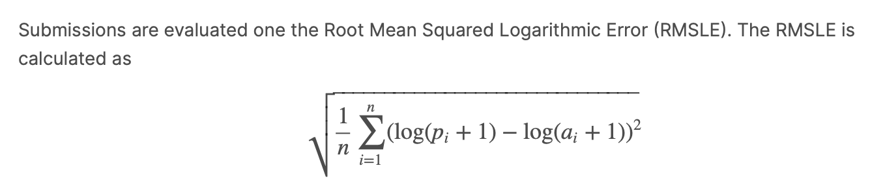
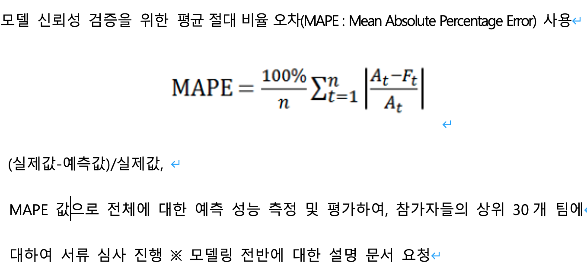
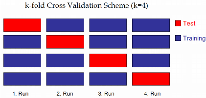

# 200924 수업

### Random Forest 알고리즘

- 의사결정트리: 오버피팅 -> 가지치기 => 부족한 알고리즘

- 랜덤포레스트: 의사결정트리의 한계를 극복하기 위한 알고리즘

- 나무 생성? 배깅

  ex) 학습 데이터 1000개(행), 25개 (속성) -> 임의로 100개의 데이터 선택(31번 반복) => 트리(31개) 구성

  속성(features)을 몇개로 하는것이 좋을까? : 

  - 가장 좋아보이는 연구결과:

  - > **전체 속성 개수의 제곱근이 가장 좋다** (25개 속성일경우 -> 5개를 속성 개수로 사용)

> 트리 작성시 사용될 피처(features)들을 제한 -> 나무에 대한 다양성
>
> 주의! 개인 컴퓨터로 하게되면 불이 날수도!!
>
> 구글 colab 사용 추천! (무료)


A.I.: 1940대~ (튜링머신)

<-----머신러닝------>

신경망(단일퍼셉트론/멀티퍼셉트론<멀티레이어>) / DT /...-> 랜덤포레스트/SVM -> 딥러닝(깊은신경망)

## scikit-learn

[sklearn.ensemble API](https://scikit-learn.org/stable/modules/classes.html#module-sklearn.ensemble)

[ensemble.RandomForestClassifier](https://scikit-learn.org/stable/modules/generated/sklearn.ensemble.RandomForestClassifier.html#sklearn.ensemble.RandomForestClassifier)

- 나중에 이 모델을 보고 튜닝할수 있을정도로 잘하면 좋습니다.

- Parameters: 

- > **n_estimators**: 트리의 개수, 트리를 몇개 만들것인지? (default = 100개), 크게 할수록 좋음 (대신 시간이 점점더 오래걸림<컴퓨터 과부하>)
  >
  > **max_depth** : 과적합과 관련된 설정. 깊으면 깊을수록 오버피팅이됨. 설정해주지 않으면 트리의 최하단까지 내려가버림/ 하지만 min_samples_split의 기본설정에 영향을 받음 (min_samples_split보다 작아질때까지 분할)
  >
  > > 과적합? : 훈련데이터로 모델평가 성능(높음) >> 실제 데이터로 모델 평가 성능(낮음)
  > >
  > > 트리의 최대 깊이 (기본값: None, 완전하게 클래스값이 결정될때까지 분할 -> 과적합이 거의 무조건 생길수 있음) 설정필요! 
  >
  > **min_samples_split** : 기본 설정 2로 되어있음, 이 값이 커지면 커질수록 오버피팅될 가능성 증가 (노드를 분할하기 위한 최소한의 데이터수 <과적합을 제어>, 작게 설정할수록 분할 노드가 많아지므로 분할 노드가 많아지므로 과적합이 증가할 수 있음.)
  >
  > **min_samples_leaf**: samples 는 데이터로 생각하면 편함, 리프노드(터미널노드)가 되기 위해 필요로하는 최소한의 샘플 데이터수 (일반적으로 작게 설정)
  >
  > 
  >
  > **최적의 랜덤포레스트 퍼러미터를 설정하는게 중요!!!** (과거 (현재)에는 수동) -> GridSearchCV를 사용해서 랜덤포레스트 하이퍼 퍼러미터 튜닝! (훌륭한 함수) [GridSearchCV](https://scikit-learn.org/stable/modules/generated/sklearn.model_selection.GridSearchCV.html#sklearn.model_selection.GridSearchCV)
  >
  > - 트리를 몇개 만들어야 할지 모르겠다~ 그럼 GridSearchCV 를 사용해서 specified parameter values 를 지정해서 최적의 값을 찾아낸다! (fit과 score값으로 찾아냄)
  >
  > > Parameters:
  > >
  > > - param_grid: 여기에 지정된 값으로 찾아줍니다.
  > >
  > >   - 이 기능이 없으면 각 설정을 따로 해본다고 했을때 (5 * 5* 10 * 30 이 되면 750번을 일일히 해봐야하는 수고가 있지만)
  > >
  > >   - ```python
  > >     #GridSearchCV example
  > >     param_grid={
  > >         'n_estimators': [11, 31, 51,100,200],
  > >         'min_samples_split': [4, 6, 8 ,10],
  > >         'max_depth' : [3, 5, 7]
  > >     }
  > >     #이 설정을 통해서 수월해진다.
  > >     ```
  > >
  > > - n_jobs: Number of jobs to run in parallel. `None` means 1 unless in a [`joblib.parallel_backend`](https://joblib.readthedocs.io/en/latest/parallel.html#joblib.parallel_backend) context. `-1` means using all processors. (-1로 설정하면 컴퓨터의 모든 프로세서를 사용)
  >
  > max_depth 설정을 꼭 해주어야한다. GridSearchCV를 통해서 최적의 깊이를 찾은뒤에. 그렇지않고 max_depth 설정을 해주지 않는다면, 모델은 항상 훈련데이터의 최적에 맞추어 평가성능(score)이 높게 나오지만, 실제로 예측을 시도하면 오히려 평가성능이 떨어진다. (오버피팅이기 때문에..) 그래서 최적의 깊이값을 찾고, 거기서 나오는 평가성능이 정확한 평가 값이다.

  

[kaggle:Bike Sharing Demand](https://www.kaggle.com/c/bike-sharing-demand/overview/evaluation)

## RMSLE

```python
def rmsle(pv, av): #예측값, 실제값
    #넘파이 배열로 변환
    pv=np.array(pv)
    av=np.array(av)
    #예측값과 실제값에 1을 더하고 로그를 씌운다
    log_predict=np.log(pv+1)
    log_actual=np.log(av+1)
    
    res=log_predict-log_actual
    res=np.square(res)
    res.mean() #합하는작업 따로 필요없음 평균을 구할때 자동임
    
    mean_res=res.mean()
    score=np.sqrt(mean_res)
    return score
```



### MAPE

```python
import numpy as np

def mape(actual, pred): 
    actual, pred = np.array(actual), np.array(pred)
    return np.mean(np.abs((actual - pred) / actual)) * 100
    
actual = [12, 13, 14, 15, 15,22, 27]
pred = [11, 13, 14, 14, 15, 16, 18]

mape(actual, pred)

10.8009
```




## Kfold 교차검증

- 일반화 성능을 측정하기 위해, 데이터를 **여러 겹(fold)**로 나누고, 만들어진 여러 모델을 학습하고 평가
  - fold 는 우리가 지정 : ex) 4, 5 ... 
  - 2 가지 fold로 분류: (나뉘어진 폴드를 다양하게 적용)
    - 트레이닝 fold
    - 테스트 fold



- ex) 100건의 데이터, 위그림 (4겹의 fold) 4등분 (1겹당 25건의 데이터<100/4>) 트레이닝과 테스트용으로 나뉨
- 첫번째 fold(테스트용, 25건), 두번째~ 네번째 fold (트레이닝용, 25*3= 75건)(오른쪽으로) : 1.정확도
- 두번째 fold(테스트용, 25건), 첫번째, 세, 네번째 fold (트레이닝용, 25*3=75건) : 2.정확도
- 세번째 fold(테스트용, 25건), 첫,두번째, 네번째 fold (트레이닝용, 25*3=75건) : 3.정확도
- 네번째 fold(테스트용, 25건), 첫~ 세번째 fold (트레이닝용, 25*3=75건) : 4.정확도
  - 정확도의 평균 (최종 모델 정확도 (sum(1~4정확도)/4))

> [관련 논문](https://www.researchgate.net/figure/k-fold-cross-validation-scheme-example_fig2_228403467)

#### 그럼 k-fold 교차검증을 안할경우?

> 데이터 100건 -> 70건(트레이닝), 30건(테스트)
>
> - 이것은 일반적이지 않다. 좀 문제가 있다.
>   - 서로 교차시키지 않고 앞에것만 모델만들때 사용하면 왜? 앞에것만 모델링할때 사용하는가? 뒤에것은?
>   - 뒤로부터 70건(트레이닝), 30건(테스트) 하게되면 또 정확도가 다르게 나온다.
>     - 그러므로 다각도로 보기위해 교차검증을 한다.


```python
#kfold 교차검증
from sklearn.model_selection import KFold
from sklearn.model_selection import cross_val_score

kfold=KFold(n_splits=10, shuffle=True, random_state=42)
# n_splits : how many folds?
# shuffle : better to shuffle (안섞으면 모델이 잘못나올수 있다.)
# random_state: seed와 같은 개념
# 순서: 셔플후 10겹으로 나뉨 
```


교차검증은 전처리를 한 모델에 대해서, 예측값이 얼마나 일반화가 잘 되어있는지 보여주는 객관적 지표로 참고용으로 사용하면 된다.

score.mean()이 높게 나온경우 (RMSLE)에서, 전처리를 더 잘할 필요가 있다는 뜻이다.


nsShop+ 의 예측해야할 데이터를 자전거데이터의 count 라고 생각하고 진행해보자

[머신러닝 repository AI연구실](http://archive.ics.uci.edu/ml/datasets.php)


### 연습문제

[유방암 데이터에서 class 예측 분류](http://archive.ics.uci.edu/ml/datasets/Breast+Cancer+Wisconsin+%28Original%29)

[캐글:Breast Cancer Wisconsin (Diagnostic) Data Set](https://www.kaggle.com/uciml/breast-cancer-wisconsin-data)

data를 살펴보면, mean, se(standard_error표준오차)가 접미어로 쓰여있다.


- 실제 정답과 예측한 정답이 얼마나 유사한지 확인
- 튜닝해보기

파일을 트레이닝과 테스트 데이터로 분류하는 초반 작업까지 진도를 나감.

```python
import pandas as pd
import numpy as np
from sklearn.model_selection import train_test_split

data=pd.read_csv("bc/data.csv")
data

data.info()

# xtrain, xtest, ytrain, ytest = train_test_split(xdata, ydata, test_size=0.3) #7:3의 비율로 나눈다.

data['diagnosis'] #M : 1, B:0 으로 변경

data['diagnosis'].value_counts()

data['diagnosis']=np.where(data['diagnosis']=='M',1,0)
# data['diagnosis']=data['diagnosis'].map({'M':1 , 'B':0})

data.columns

dataMean=data[['diagnosis', 'radius_mean', 'texture_mean', 'perimeter_mean',
       'area_mean', 'smoothness_mean', 'compactness_mean', 'concavity_mean',
       'concave points_mean', 'symmetry_mean', 'fractal_dimension_mean']]

dataMean
dataMean.columns

y=dataMean.loc[:,['diagnosis']]
y

y=np.ravel(y) #data를 1차원으로 만들어 주는 함수, flatten과 같은 용도
y

#2 퀴즈
x=dataMean.iloc[:,1:]
x

xTrain, xTest, yTrain, yTest = train_test_split(x, y, test_size=0.2, random_state=0) #8:2의 비율로 나눈다.

xTrain.shape, xTest.shape

yTrain.shape, yTest.shape

xTrain, yTrain -> 모델 생성 -> xTest 입력 -> 예측값과 yTest(정답)를 비교 -> 정확도 출력
```

